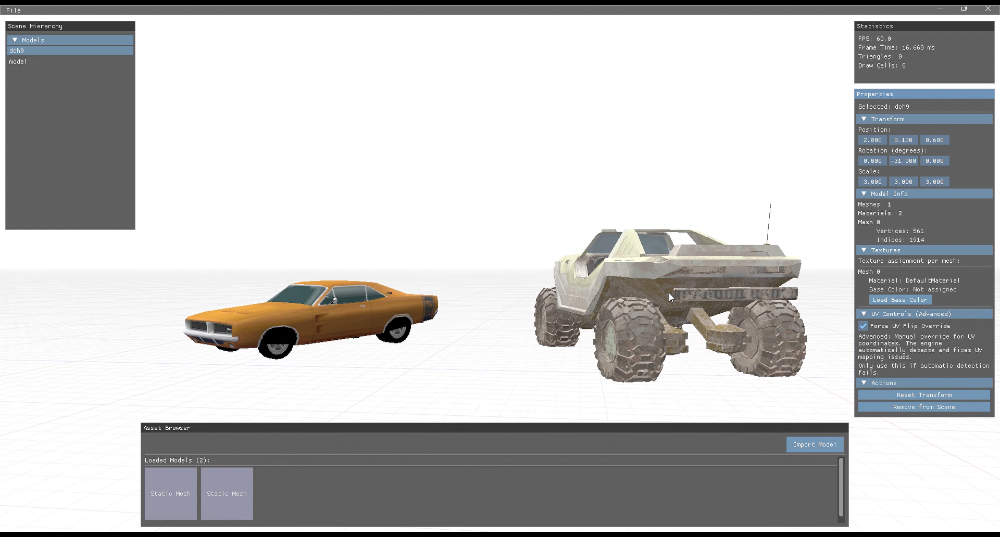

# Vulkan 3D Model Viewer

<div align="center">


A high-performance 3D model viewer built with modern Vulkan API, featuring advanced UV mapping algorithms, real-time rendering, and an intuitive drag-and-drop interface.

[](LICENSE)
[](https://vulkan.org/)
[](https://github.com/yourusername/vulkan-3d-model-viewer)

</div>

## Features

### 🎨 **Rendering**
- **Vulkan API Integration** - High-performance, low-level graphics rendering
- **Real-time Lighting** - Multiple light sources with enhanced ambient lighting
- **Anti-aliased Rendering** - Smooth edges and professional quality output
- **Texture Mapping** - Full PBR material support with automatic UV optimization

### 🔧 **UV Mapping System**
- **Automatic UV Detection** - Intelligent analysis of texture coordinate patterns
- **UV Scrambling Fix** - Advanced algorithms to detect and correct texture mapping issues
- **Multi-variant Analysis** - Tests multiple UV transformations to find optimal mapping
- **Per-mesh Optimization** - Individual analysis for complex multi-mesh models

### 🖥️ **User Interface**
- **Drag & Drop Support** - Intuitive model and texture loading
- **Asset Browser** - Organized view of loaded 3D models with thumbnails
- **Scene Hierarchy** - Tree view of all objects in the scene
- **Properties Panel** - Real-time editing of transforms, materials, and UV settings
- **Statistics Display** - Live FPS, triangle count, and performance metrics

### 📁 **Wide Format Support**
- **3D Models**: OBJ, FBX, GLTF/GLB, DAE, BLEND, STL, 3DS, PLY, and many more
- **Textures**: PNG, JPG, JPEG, TGA, BMP, DDS, HDR
- **Powered by Assimp** - Industry-standard model loading library

## 🖼️ Screenshots

### Main Interface
*3D model viewing with imgui UI*


### Multi-Model Scene
*Load and view multiple 3D models simultaneously*


### Texture Assignment
*Easy load texture assignment per mesh*


### Real-time Transform Editing
*Intuitive transform controls with live preview*


## 🚀 Getting Started

### Prerequisites

- **Windows 10/11** (64-bit)
- **Vulkan SDK** 1.3 or later
- **Visual Studio 2019/2022** with C++17 support
- **CMake** 3.16 or later
- **Git** for cloning the repository

### Installation

1. **Clone the repository**
   ```bash
   git clone https://github.com/Sacid66/vulkan-3d-model-viewer.git
   cd vulkan-3d-model-viewer
   ```

2. **Install Vulkan SDK**
   - Download from [LunarG Vulkan SDK](https://vulkan.lunarg.com/)
   - Install and ensure `VULKAN_SDK` environment variable is set

3. **Build the project**
   ```bash
   mkdir build
   cd build
   cmake ..
   cmake --build . --config Release
   ```

4. **Run the application**
   ```bash
   ./VulkanModelViewer.exe
   ```

## Usage

### Loading Models
1. **Drag & Drop**: Simply drag 3D model files into the application window
2. **Import Button**: Use the "Import Model" button in the Asset Browser
3. **Scene Addition**: Drag models from Asset Browser to Scene Hierarchy

### Texture Assignment
1. Select a model in the Scene Hierarchy
2. Open the "Textures" section in Properties panel
3. Click "Load Base Color" for any mesh
4. Select your texture file

### Transform Controls
- **Position**: Drag the XYZ sliders to move objects
- **Rotation**: Rotate objects around each axis
- **Scale**: Uniformly or non-uniformly scale models
- **Reset**: Quick reset to default transform


## Architecture

### Core Components

```
vulkan-3d-model-viewer/
├── src/
│   ├── core/           # Vulkan device, instance, surface management
│   ├── rendering/      # Rendering pipeline, shaders, command buffers
│   ├── scene/          # Model loading, materials, mesh processing
│   ├── ui/             # ImGui interface, panels, controls
│   └── main.cpp        # Application entry point
├── shaders/            # GLSL vertex and fragment shaders
├── assets/             # Sample models and textures

```

### Key Technologies
- **Vulkan API** - Low-level graphics rendering
- **GLFW** - Window management and input handling
- **ImGui** - Immediate mode GUI framework
- **Assimp** - 3D model loading and processing
- **GLM** - OpenGL Mathematics library
- **STB** - Image loading and processing

## UV Mapping Algorithm

The application features a sophisticated UV mapping system that automatically detects and corrects texture coordinate issues:

### Analysis Phases
1. **Coherence Analysis** - Examines UV coordinate smoothness between adjacent vertices
2. **Cluster Analysis** - Detects logical grouping of UV coordinates
3. **Geometric Consistency** - Correlates 3D mesh geometry with UV space
4. **Coverage Analysis** - Evaluates texture space utilization efficiency
5. **Scrambling Detection** - Identifies chaotic UV patterns indicating mapping issues

### Optimization Process
```cpp
// Generate 4 UV variants: Original, V-flip, U-flip, Both-flip
std::vector<std::vector<glm::vec2>> uvVariants = {
    generateUVVariant(mesh, 0), // Original
    generateUVVariant(mesh, 1), // V-flipped  
    generateUVVariant(mesh, 2), // U-flipped
    generateUVVariant(mesh, 3)  // Both flipped
};

// Analyze and select best variant
int bestVariant = detectBestUVVariant(mesh, uvVariants);
```

## Contributing

We welcome contributions! Here's how you can help:

1. **Fork** the repository
2. **Create** a feature branch (`git checkout -b feature/AmazingFeature`)
3. **Commit** your changes (`git commit -m 'Add some AmazingFeature'`)
4. **Push** to the branch (`git push origin feature/AmazingFeature`)
5. **Open** a Pull Request

### Development Guidelines
- Follow existing code style and conventions
- Add comments for complex algorithms
- Test with various 3D model formats
- Update README for new features


### Upcoming Features
- [ ] **PBR Materials** - Full physically-based rendering support
- [ ] **Animation Support** - Skeletal and keyframe animation playback
- [ ] **Export Functionality** - Save modified models and textures
- [ ] **Lighting Editor** - Interactive light placement and configuration
- [ ] **Plugin System** - Custom importers and effects
- [ ] **Linux Support** - Cross-platform compatibility

### Performance Improvements
- [ ] **Mesh Optimization** - Automatic LOD generation
- [ ] **Texture Streaming** - Large texture handling
- [ ] **Multithreading** - Parallel model processing
- [ ] **GPU Culling** - Hardware-accelerated frustum culling

## Known Issues

- Complex UV scrambling patterns may require manual intervention
- Some FBX files with embedded textures may need re-export
- Performance may decrease with extremely high-poly models (>1M triangles)


## Acknowledgments

- **Khronos Group** for the Vulkan specification
- **Assimp Team** for the excellent 3D model loading library
- **Dear ImGui** for the immediate mode GUI framework
- **GLFW** for cross-platform window management
- **STB** libraries for image processing

---

<div align="center">

**Made with Vulkan**


</div>
